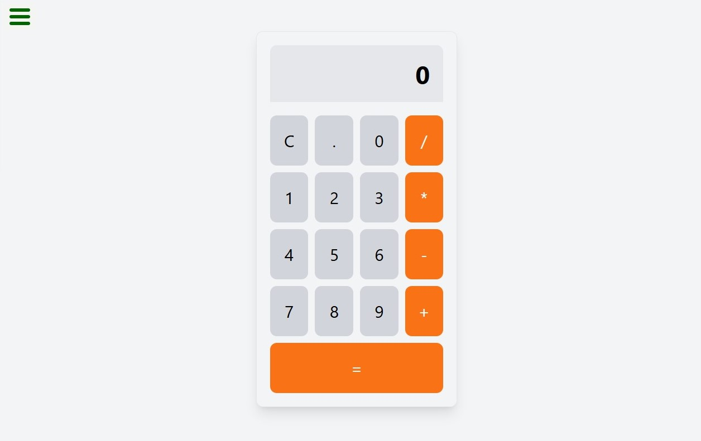

# Javascript-Calculator
 

You can check the live dimo of project [here](https://drum-machine-ten-mocha.vercel.app/)
#### The JavaScript Calculator is a simple, interactive web-based calculator built using HTML, CSS, and JavaScript. It provides basic arithmetic functionalities such as addition, subtraction, multiplication, and division. The project aims to showcase fundamental web development skills and JavaScript programming concepts.

# Features
#### 🔹 Basic Arithmetic Operations: Perform addition, subtraction, multiplication, and division.

#### 🔹 Clear Functionality: Clear the input and reset the calculator.

#### 🔹 Decimal Support: Handle decimal numbers for more precise calculations.

#### 🔹 Responsive Design: Works on both desktop and mobile devices.

#### 🔹 Error Handling: Displays error messages for invalid operations, such as division by zero.

# Technologies Used

### React: For building the user interface and managing component states.

### Tailwind CSS: For styling the application, making it visually appealing and responsive.

### JavaScript: For handling user interactions and audio playback.

# Getting Started

Prerequisites
Make sure you have the following installed:

Node.js
npm (Node Package Manager)

# How to Use
1️⃣ `creat a new repository in your github`

2️⃣  `Create a New Project Directory`

Open your terminal or command prompt. Navigate to the directory where you want to create your project. Run the following command to create a new directory for your project: bash Copy code mkdir documentation-project

3️⃣  `open HTML in any program such you want ssuch us: vscode, terminal and cmd`

4️⃣ `creat a  HTML file`

4️⃣ `creat a  javascript file`

5️⃣ `give a style to project by creating style.css file` 

6️⃣ `use (git add, git commint, git push) in the git bash to push it in Github`

7️⃣  `Make a string and uniqe project-Readme.md file`

# Usage

#### ◻ Input Numbers: Click on the number buttons to enter digits.
#### ◻ Select Operation: Click on the operation buttons (+, -, *, /) to choose an arithmetic operation.
#### ◻ Calculate Result: Click the = button to get the result of the operation.
#### ◻ Clear Input: Click the C button to clear the current input and reset the calculator.

# Code Overview

#### ◻ HTML (index.html): Defines the structure of the calculator.
#### ◻ CSS (styles.css): Contains the styling for the calculator’s appearance.
#### ◻ JavaScript (script.js): Implements the functionality and logic for calculator operations.

# Author 🔵✅
◻ Github: WALWALA SAFI (https://github.com/WALWALASAFI/product-landing-page.git)

◻ Linkedin:  walwala safi (https://www.linkedin.com/in/walwala-safi-65b56530a/)

◻ Email: walwala safi (walwalasafi99@gmail.com)
